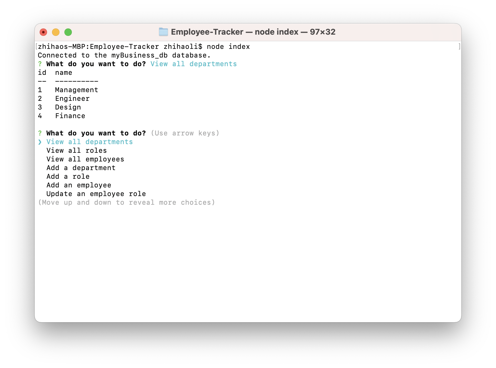
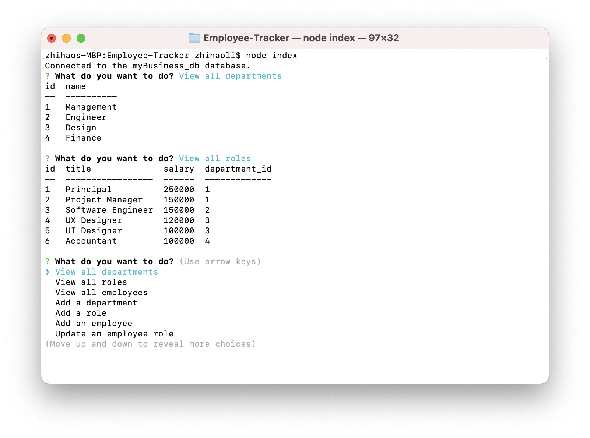
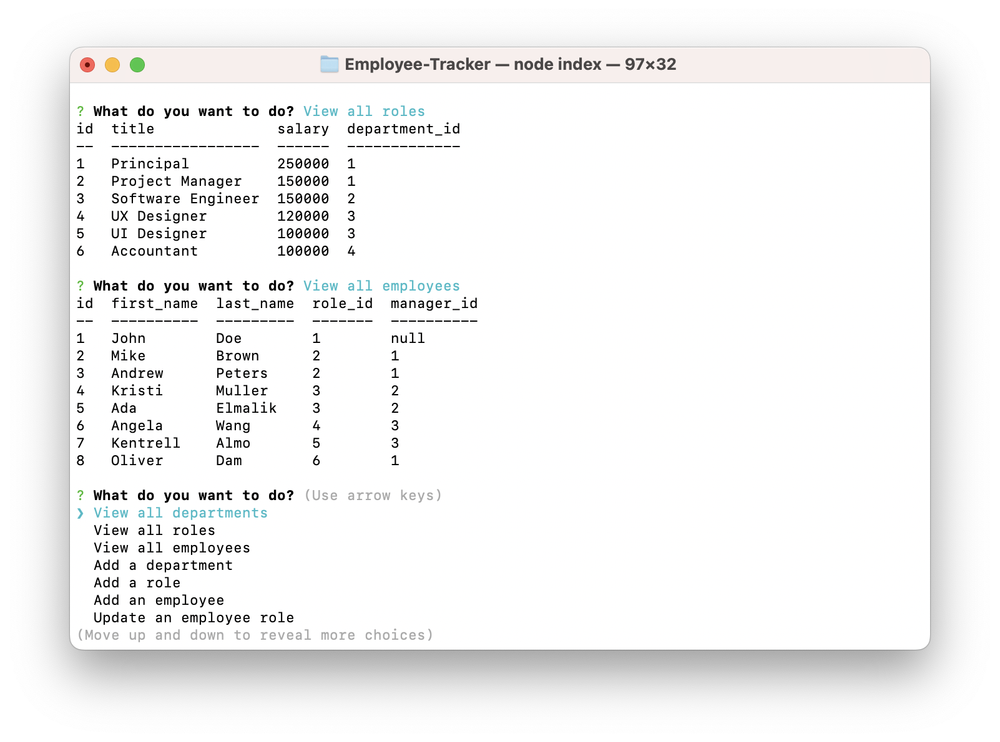
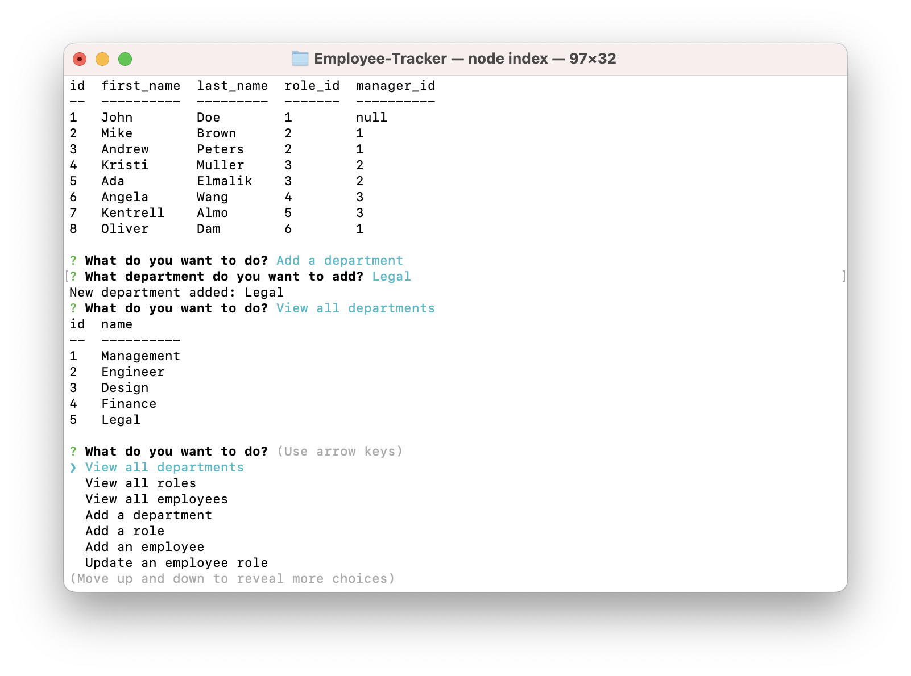
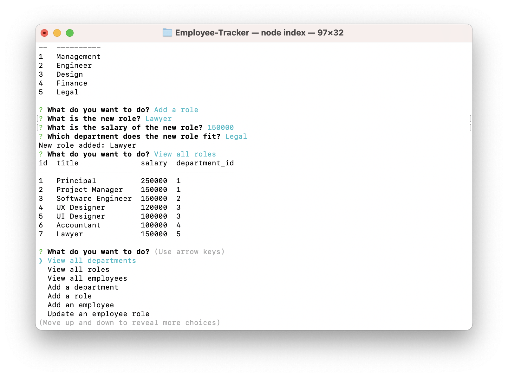
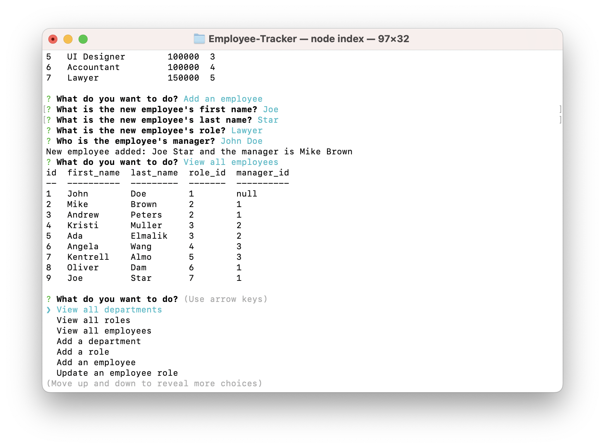
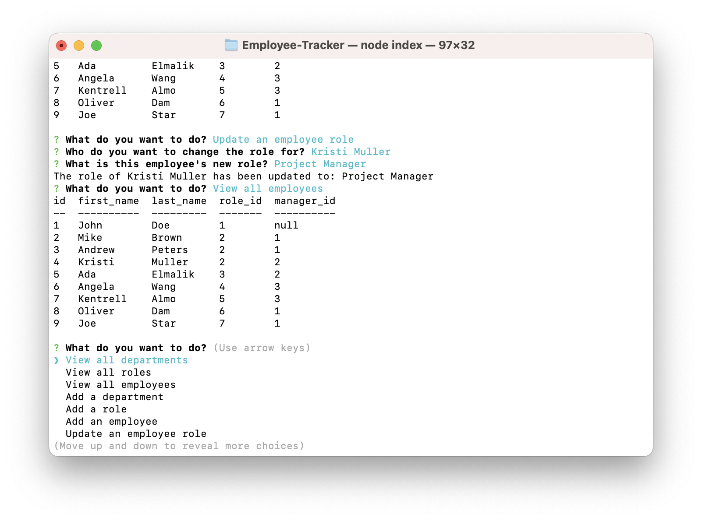
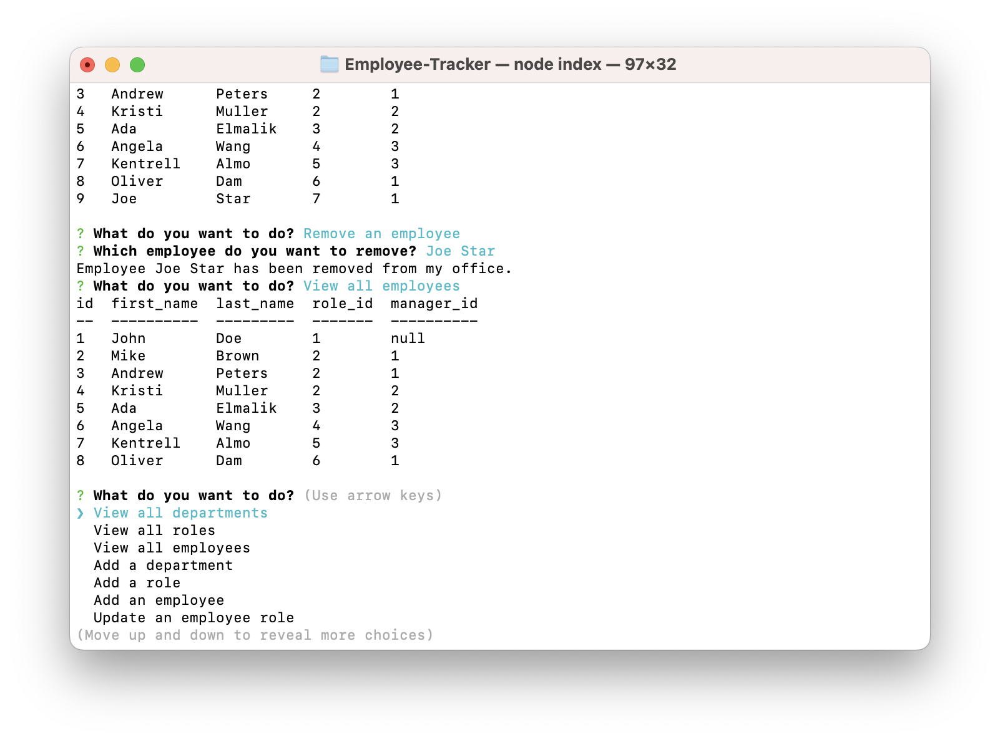
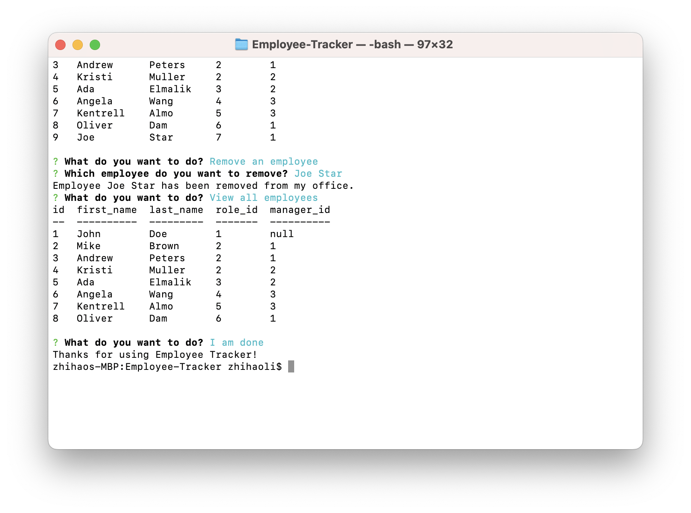

# Employee-Tracker

## Description
A command-line application to manage a company's employee database, using Node.js, Inquirer, and MySQL. The interface of this application allows non-developers to easily view and interact with information stored in databases.

## Table of Contents
1. [Installation](#Installation)
2. [Usage](#Usage)
3. [Contributing](#Contributing)
4. [License](#License)
5. [Tests](#Tests)
6. [Questions](#Questions)
7. [Screenshots](#Screenshots)
8. [Walkthrough Video](#Walkthrough)

## Installation 
1. Install package.json with command `npm i`
2. Install Inquirer with command `npm i inquirer@8.2.4`
3. Install MySQL2 with comment `npm i mysql2`

## Usage 
1. Opening an external ternimal from the repository
2. Run the application with command: `node index`
3. Answer all prompt questions and select 'I am done' when finished

## Contributing 

### Zhihao Li
https://github.com/lzh1990214/Employee-Tracker

### MySQL2
https://www.npmjs.com/package/mysql2

### Inquirer
https://www.npmjs.com/package/inquirer?activeTab=readme

## License 
UNLICENSED

## Tests 
N/A

## Questions 

### Github
https://github.com/lzh1990214

### Email
zli02@alumni.risd.edu

## Screenshots 

### View all Departments

### View all Roles

### View all Employees

### Add a Departments

### Add a Role

### Add an Employee

### Update an Employee Role

### Remove an Employee

### End Message

## Walkthrough Video 
https://youtu.be/0K7MEzLfuGQ
